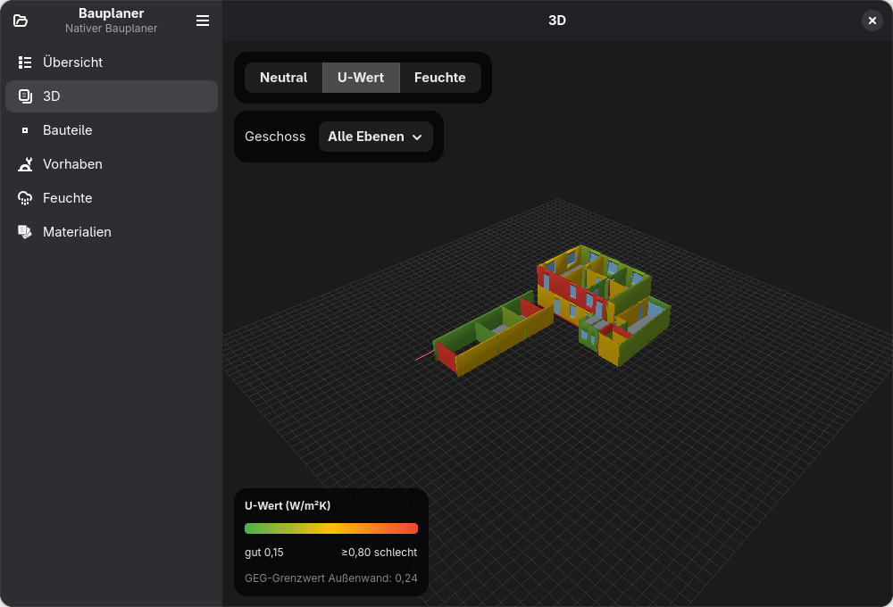

# Bauplaner

A native **GNOME / Adwaita** planner for the **ecological retrofit of old
buildings** — built on [gjsify](https://github.com/gjsify/gjsify) / GJS with
GTK 4 + libadwaita. Import a [Sweet Home 3D](https://www.sweethome3d.com/) model,
see it in 3D, and layer a building-physics assessment on top: wall build-ups with
**U-value / GEG / Glaser**, **damp-wall diagnosis**, earthworks, and quantities
for **natural building materials** (clay, lime, wood-fibre, DERNOTON …).

Unlike generic CAD, the focus is **diffusion-open construction and ecological
materials** — and *calculating* the real retrofit, not just drawing it.



> 📸 **[Full screenshot tour →](docs/app-ui/README.md)** — every view, annotated.

## What it does

- **Import** a Sweet Home 3D `.sh3d` — levels, rooms, walls, footprint.
- **3D view** (three.js on the WebGL→`Gtk.GLArea` bridge): walls with openings cut
  out, colour-coded by **U-value** or **moisture**, click a wall to inspect it.
- **Bauteile** — assign layered wall build-ups from presets; live U-value,
  Tauwasser (Glaser / DIN 4108-3) and GEG check.
- **Feuchte** — rule-based damp-wall diagnosis (rising damp, condensation, leak,
  driving rain), anchored to the wall.
- **Vorhaben** — own earthworks (e.g. a *Lehmgraben* clay-sealed trench) with
  material quantities.
- **Materialien** — the ecological material stock (ρ, λ, µ).
- **Förderung** — the BEG-EM subsidy for the heat generator (Nr. 5.3 / KfW 458)
  with its bonus stack, ceilings and cut-off dates. The rules that move over time
  are modelled as dated validity spans, so the tool can also answer the question
  that actually decides the schedule: *what does waiting cost?*
- **Sanierungsplan als PDF** — export the whole assessment as a laid-out A4
  document in the app's own visual language: Kennzahlen, the A+…H energy scale,
  the iSFP measure roadmap with subsidy and own share, and the ranked wall
  build-ups with their layer strips. Built for the conversation with a bank or a
  Finanzberater, and explicit about what it is not.

Also usable headless via the CLI (`@bauplaner/cli`: `inspect`, `wand`,
`envelope`, `lehmgraben`, `bauteil`, `feuchte`, `funding`, `materials`,
`varianten`, `report`). `envelope` is the Aufmaß of the heated envelope —
exterior wall area net of its openings, the window/door split, and the
ceiling/floor area against unheated space or the ground, each pro-rated from the
model geometry. `funding` computes the heating subsidy for a given application
date and, with `--deadlines`, lists the coming Stichtage with the euro
difference:

```bash
bauplaner funding --kosten 32000 --altanlage oel --einkommen 38000 --kinder 1
bauplaner funding --kosten 32000 --altanlage oel --deadlines
```

Status: **early** — a read-only diagnostic surface today (Sweet Home 3D stays the
geometry editor; a project sidecar adds the retrofit layer). See the
[vision](docs/concept/vision.md) for where it's headed.

## Architecture

Kernel-first: all domain logic lives in a runtime-agnostic TypeScript core; the CLI
and the native app are thin adapters that reuse it **in-process** (no HTTP).

| Package | Scope | Role |
|---------|-------|------|
| `packages/core` | `@bauplaner/core` | geometry, `.sh3d` import, project model, scene |
| `packages/materials` | `@bauplaner/materials` | material stock + calculations (quantities, U-value, Glaser) |
| `packages/diagnose` | `@bauplaner/diagnose` | rule-based damp-wall diagnosis |
| `packages/report` | `@bauplaner/report` | Sanierungsplan document model + PDF renderer (cairo/Pango) |
| `cli` | `@bauplaner/cli` | CLI + the native GNOME/Adwaita app (`cli/src/app`) |

## Build & run

Requires the [gjsify](https://github.com/gjsify/gjsify) toolchain (Node 24 to
bootstrap) and a working **GTK 4 / libadwaita** on the system (GJS uses the real
libraries via GObject-Introspection).

The toolchain is `gjsify` end-to-end — no `npm` is needed. From the repo root:

```bash
gjsify install          # install deps (never `npm install` — it prunes gjsify deps)
gjsify run dev:app      # build + launch the native app
gjsify run build        # build the CLI bundle
gjsify run check        # type-check (gjsify tsc)
gjsify run test         # run the test suite under gjs
```

Export a plan without opening the app:

```bash
cd cli
gjsify run dist/bauplaner.gjs.mjs report --file demo/beispielhaus.ecoretrofit.json \
  --out sanierungsplan.pdf
gjsify run dist/bauplaner.gjs.mjs report --area 200 --out wandentscheidung.pdf
```

The root scripts delegate into the `cli` workspace; you can also run them there
directly with `cd cli && gjsify run <script>`. More detail — and the `BP_APP_*`
dev hooks — in [`cli/src/app/README.md`](cli/src/app/README.md).

## Privacy

The **tool and methodology are open**; concrete object data (address, the real
building model, receipts) stays **private** and never enters this repository.
Documents/datasheets are referenced via Paperless-ngx, not checked in as raw files.

## License

Code is [MIT](LICENSE). Documentation is CC BY-SA 4.0.
