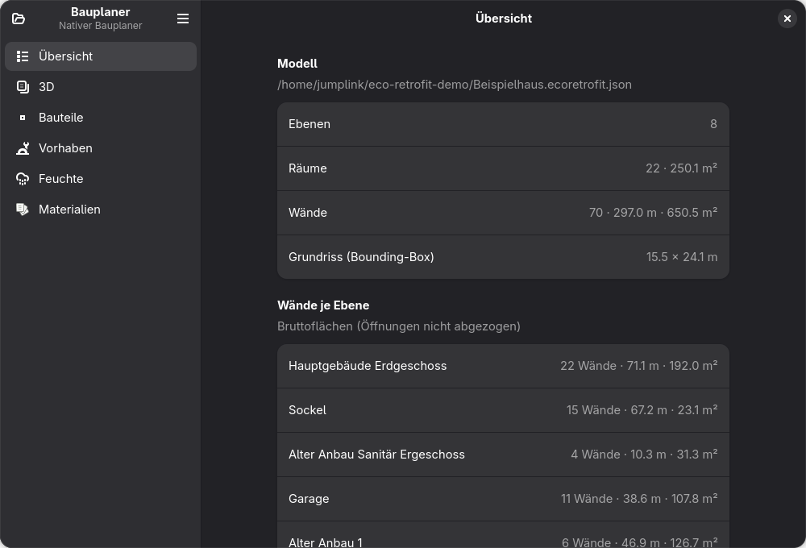
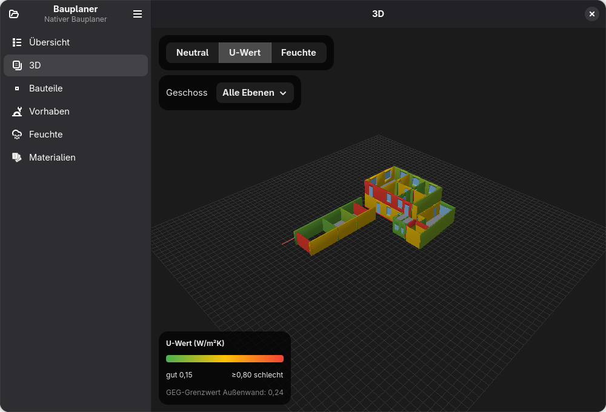
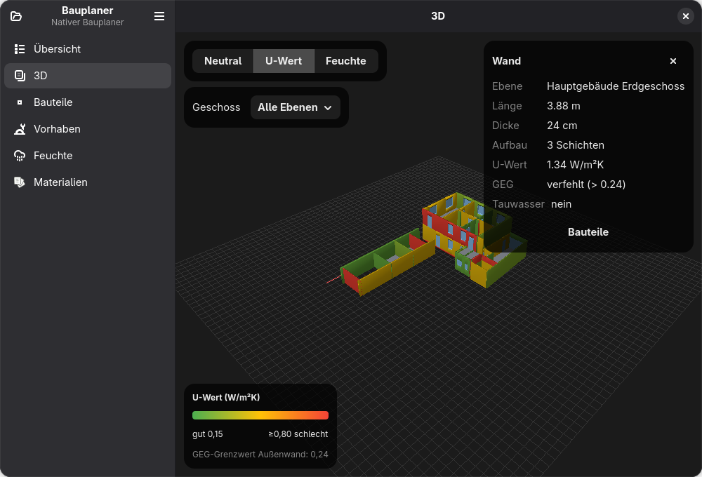
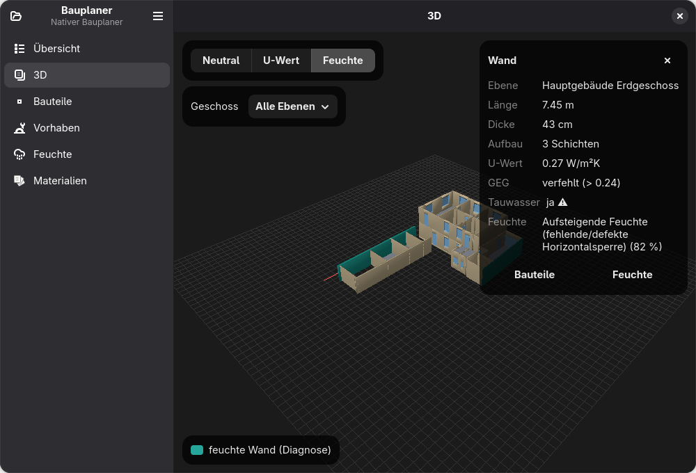
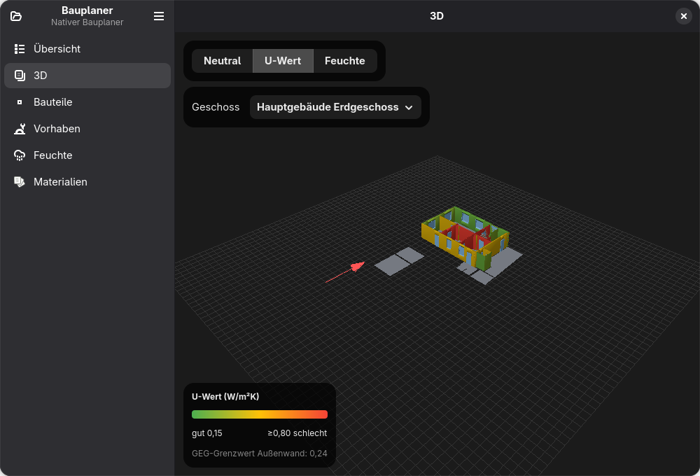
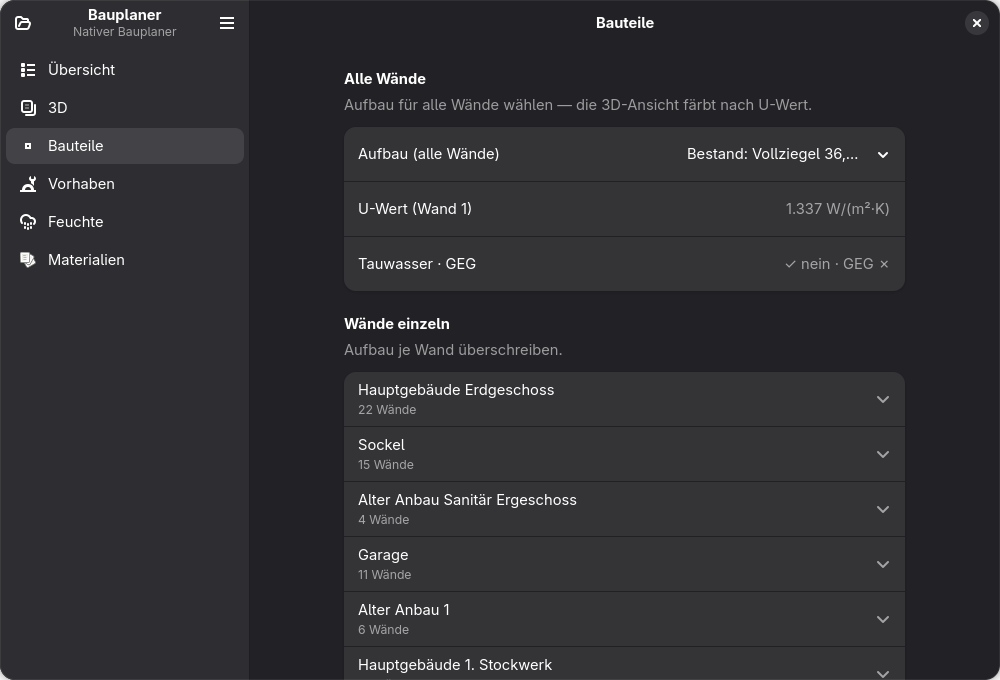
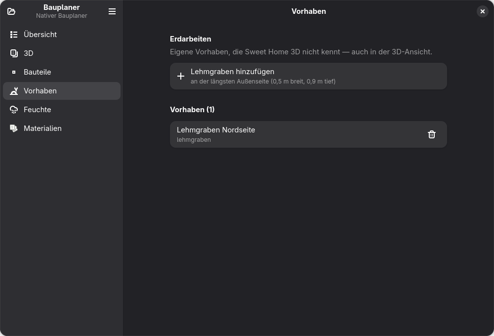
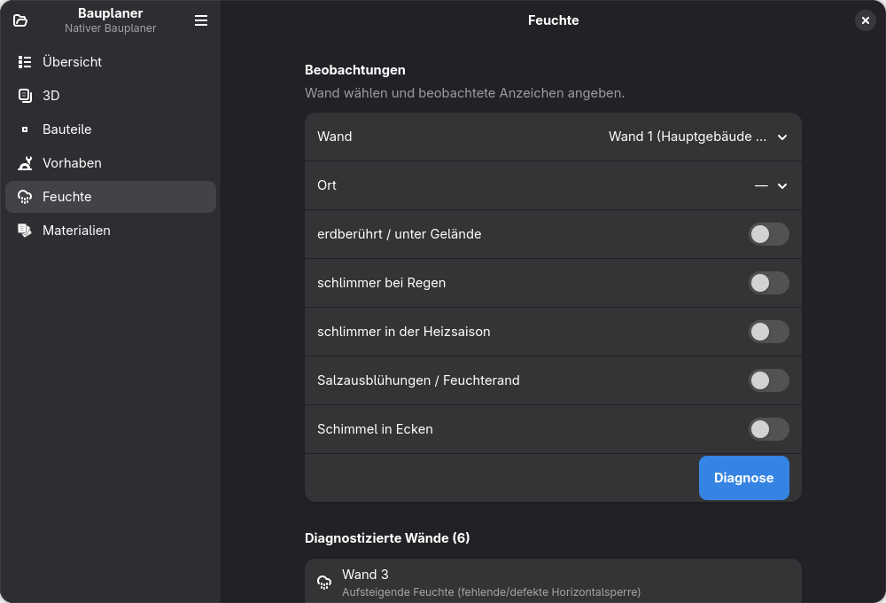
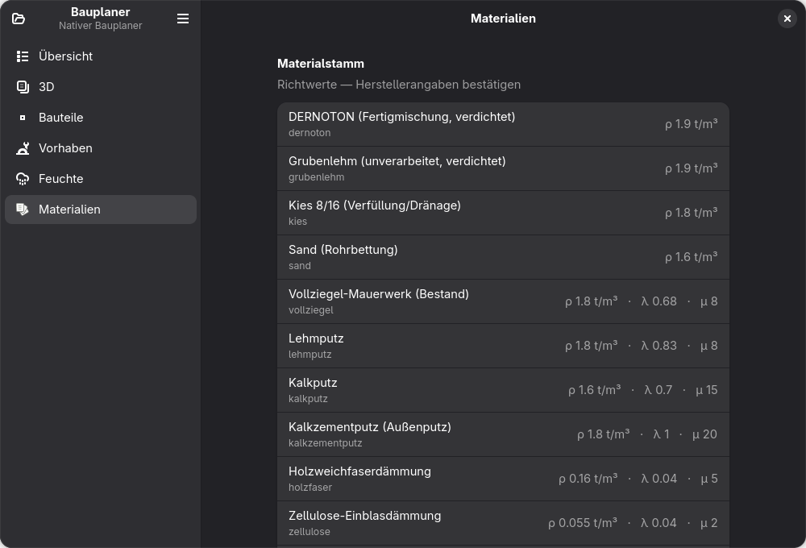

# Bauplaner — UI screenshots

A visual snapshot of the native **GNOME / Adwaita** desktop app (**Bauplaner**,
app‑id `eu.jumplink.Bauplaner`) — the desktop sibling of the CLI,
built on **gjsify / GJS** with GTK 4 + libadwaita. Both front‑ends reuse the same
kernel (`@bauplaner/core`, `@bauplaner/materials`, `@bauplaner/diagnose`)
in‑process, no HTTP.

The app is currently a **read‑only diagnostic surface**: it opens a Sweet Home 3D
model, renders it in 3D, and layers our retrofit assessment on top (wall build‑ups
with U‑value / GEG / Glaser, damp‑wall diagnosis, own earthworks). Editing the
geometry stays in Sweet Home 3D; our project sidecar adds the retrofit layer.

For the app internals and dev hooks see
[`../../cli/src/app/README.md`](../../cli/src/app/README.md); the product vision is
in [`../concept/vision.md`](../concept/vision.md).

> **About the data in these shots.** The geometry is a Sweet Home 3D model (the
> concrete object model stays private and is not part of this repository). The wall
> build‑ups and moisture flags are an **illustrative demo sidecar** — synthetic
> sample annotations spread across the walls purely to exercise the colouring /
> inspector / diagnosis features. They are **not** a real building assessment, and
> the U‑values / causes shown are made up.

The window renders in the system light/dark theme (dark here), 1000 × 680.

## Übersicht

Open a `.sh3d` file (or an `*.ecoretrofit.json` project) and see a summary from the
core parser + geometry: number of levels, rooms (with total floor area), walls
(count · total length · gross wall area) and the footprint bounding box, plus a
per‑storey wall breakdown (gross areas — openings not subtracted).



## 3D

The building rendered with three.js on the WebGL → `Gtk.GLArea` bridge, from the
core scene generator: walls as extruded footprints, **mitered** at connected ends
and with **door/window openings cut out** (pillars + lintel + sill), room floors,
and furniture/doors/windows as their embedded OBJ meshes. An orbit camera drives
the view; a red ground arrow marks **north** (from the model's compass) and the sun
lights the south façades. A floating segmented control switches the wall
**colouring mode**; a *Geschoss* dropdown isolates a single storey.

### U‑Wert mode

Walls that carry a build‑up are tinted by U‑value (green good → red bad) with a
legend showing the ramp and the GEG limit for an external wall (0,24 W/(m²·K)).



### Click inspector

**Click a wall** to open an inspector card: owning storey, length, thickness,
layer count, U‑value, GEG pass/fail and the Glaser/Tauwasser flag. Its buttons jump
to **Bauteile** / **Feuchte** with that wall focused. Dragging still orbits the
camera (raycast pick vs. drag are separated by a movement threshold).



### Feuchte mode

Walls that carry a moisture diagnosis are tinted teal. The inspector adds the
diagnosed cause and its confidence (e.g. *Aufsteigende Feuchte … 82 %*) and the
Tauwasser warning.



### Geschoss isolation

The *Geschoss* dropdown restricts the scene to a single storey (here *Hauptgebäude
Erdgeschoss*) — only that level's walls and floor slabs render, which untangles
multi‑storey models.



## Bauteile

Assign a wall build‑up from a preset — globally to **all walls** (with the live
U‑value / Tauwasser / GEG for wall 1) or per wall, grouped by storey in collapsible
expanders. The 3D view recolours by U‑value from the same annotations.



## Vorhaben

Our own retrofit **works** that Sweet Home 3D can't represent — e.g. a *Lehmgraben*
(clay‑sealed trench) along a façade. Add a default one, list them, remove them; they
render in the 3D scene and are stored in the project.



## Feuchte

Rule‑based **damp‑wall diagnosis** (`@bauplaner/diagnose`): pick a wall, tick the
observed signs (below grade, worse in rain, worse in the heating season, salt
efflorescence, mould in corners), and run *Diagnose*. The result is anchored to the
wall as an annotation (which flags it teal in 3D); diagnosed walls are listed below.



## Materialien

The material stock behind the assessments — density (ρ, t/m³), thermal conductivity
(λ, W/(m·K)) and vapour‑diffusion resistance (µ) for the ecological build‑up
materials (DERNOTON, Grubenlehm, Vollziegel, Lehm/Kalk plasters, wood‑fibre and
cellulose insulation, …).



## How these were captured

Reproducible from the app's dev hooks + the gjsify devtools D‑Bus screenshot
(`org.gjsify.Devtools.Screenshot`), driven headless on the Wayland session:

```bash
# per view: preset the state via env hooks, then screenshot over D-Bus
GJSIFY_DEVTOOLS=1 \
  BP_APP_FILE=~/bauplaner-demo/Beispielhaus.ecoretrofit.json \
  BP_APP_VIEW=ansicht3d BP_APP_COLORMODE=uwert BP_APP_PICKWALL=<wall-id> \
  npm run start:app --workspace cli
# → gdbus call … org.gjsify.Devtools.Screenshot ""  (returns PNG bytes)
```

The `BP_APP_*` hooks (`BP_APP_VIEW`, `BP_APP_COLORMODE`, `BP_APP_PICKWALL`,
`BP_APP_LEVEL`, `BP_APP_EDITWALL`) are documented in the
[app README](../../cli/src/app/README.md#dev-hook).

## Related

- [Native app README](../../cli/src/app/README.md) — build/run, structure, dev hooks
- [Project vision](../concept/vision.md) — where the planner is headed
- [Repository README](../../README.md) — project overview
